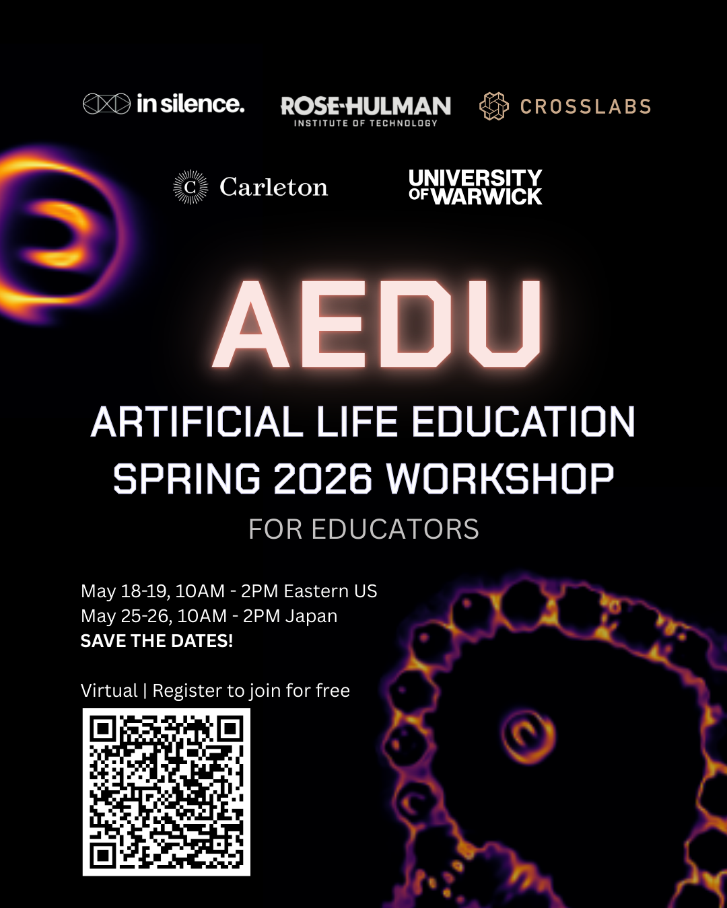

  <h1>AEdu: The 2026 Virtural Workshop in Artificial Life Education</h1>

This repository, alongside [a few](https://github.com/MuchAEDu/awesome_aedu) others, are my own personal notes for the 2026 AEdu Artificial Life Education workshop. The official page is at [https://alife-edu.github.io/aedu-virtual-workshop-2026.html](https://alife-edu.github.io/aedu-virtual-workshop-2026.html), and you can register for the event [here](https://docs.google.com/forms/d/e/1FAIpQLSeQ-ngpkBxr58mm8rGCKmU9Dna8DVHER3gXP8aZ6n0YpuO77A/viewform).

AEdu is a virtual workshop for educators bringing Artificial Life into their practice and ALife researchers bringing education into theirs. The workshop will take place virtually and we aim to cover two major time zones: The workshop will cover western time zones with sessions on May 18 and 19 from 10:00 to 14:00 EDT (UTC 14:00 to 18:00), and eastern time zones on May 25 and 26 10:00 to 14:00 JST (UTC 19:00 to 23:00).

The theme of the first day's session is "Why?" while the second day covers "How?". We'll cover a range of topics with a diverse array of speakers and participants from different disciplines, career stages, and roles.

We will have lightning talks, discussion groups, constructive activities, and traditional talks (of which you're welcome to propose your own!).

AEdu is free to attend, and you can register (by May 1) at <a href="https://forms.gle/YkS3yWknoLdFCAMz6">https://forms.gle/YkS3yWknoLdFCAMz6</a>.

  
   

<h2>Links</h2>

<ul>
	<li> ALife-edu community page: <a href="https://alife-edu.github.io">https://alife-edu.github.io</a>
  <li> Registration form: <a href="https://forms.gle/YkS3yWknoLdFCAMz6">https://forms.gle/YkS3yWknoLdFCAMz6</a>.
  <li> Event page (<a href="https://alife-edu.github.io/aedu-virtual-workshop-2026.html">ALife-Edu</a>) 
  <li> Event page (<a href='https://www.beinsilence.com/events/artificial-life-education-2026-spring-workshop'>In Silence</a>) 
</ul>

